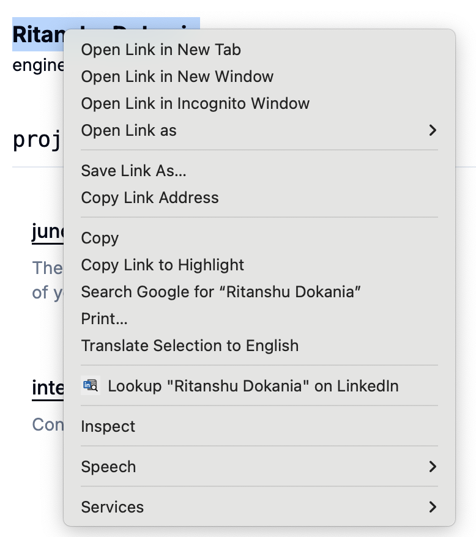

# 🔍 LinkedIn Highlight Search — Chrome Extension

A simple Chrome extension that lets you highlight any text on a webpage and instantly search it on LinkedIn using the right-click context menu.



## 🚀 Features

- Right-click any selected text to search on LinkedIn  
- No background data collection — lightweight and private  
- Works on any webpage  

## 📦 Installation

### 🧪 Manual Installation (from GitHub)

1. **Clone or download this repository**:

   ```bash
   git clone https://github.com/rfrlcode/linkedin-search-extension
2.	Open Google Chrome and go to chrome://extensions/
3.	Turn on Developer Mode (top right)
4.	Click Load unpacked
5.	Select the cloned/downloaded folder

✅ Done! Now highlight any text on a page, right-click, and select “Search LinkedIn for ‘…’”

## 🕵️ Privacy

This extension does not collect or store any personal data. All operations are done locally in your browser.

## 🙌 Contributing

If you find a bug or want to suggest a feature, feel free to open an issue or submit a pull request.

## License

This project is licensed under the MIT License - see the [LICENSE](LICENSE) file for details.

⸻

Made with ❤️ by Ritanshu

[](https://x.com/ritanshu675)